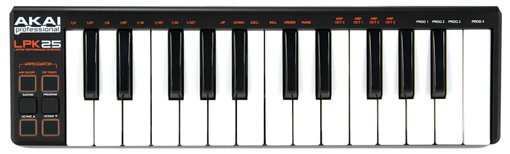

# Autohotkeys_for_MIDI_Keyboard

 reprogram MIDI keyboard with Autohotkey

Here you can use the open source project [midi4ahk : GitHub](https://github.com/micahstubbs/midi4ahk) so that you don't have to script from zero

 - install Autohotkey from https://www.autohotkey.com/ or "AutoHotkey Plus Plus" (Mark Wiemer) can be installed on VScode

 - if Autohotkey has been installed, simply execute the file *midi_in_lib_test.ahk*

 - the MIDI keyboard should be recognized automatically, no further settings are necessary (i use the AKAI-LPK25 for this, but it should also work with any other MIDI keyboard)

 - An overview of the MIDI note numbers can be found here [InspiredAcoustics](https://www.inspiredacoustics.com/en/MIDI_note_numbers_and_center_frequencies)

 